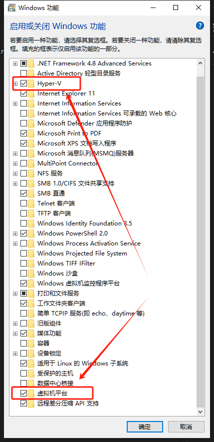

# Docker 教程

## 搭建私人 docker 镜像源教程

[搭建私人 docker 镜像源教程](https://www.bilibili.com/video/BV1eYZQYsEpi/)

## 如何使用 Docker

## 可能遇到的问题

1. docker desktop 启动报错：Docker Desktop - Virtual Machine Platform not enabled
   解决：
   1. Windows 服务打开 hyper V
   2. 打开虚拟机平台  
      

## 公司项目架构图

## 使用 Portainer 管理 Docker
