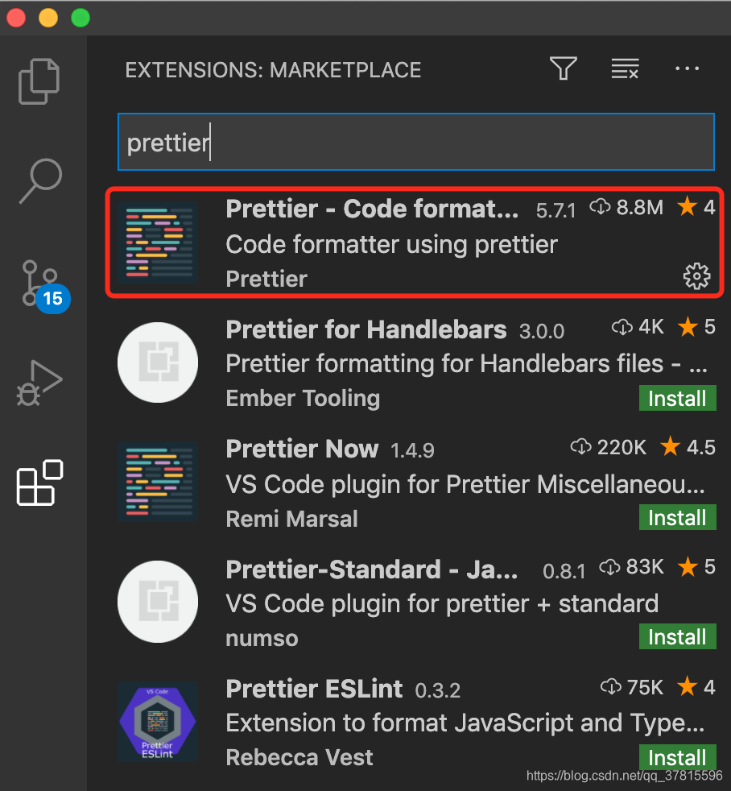
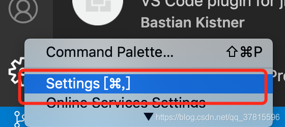
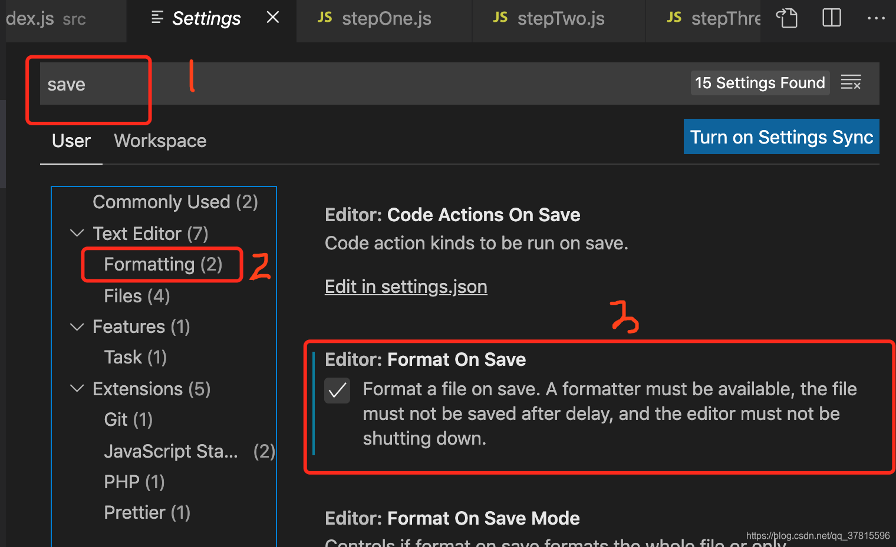
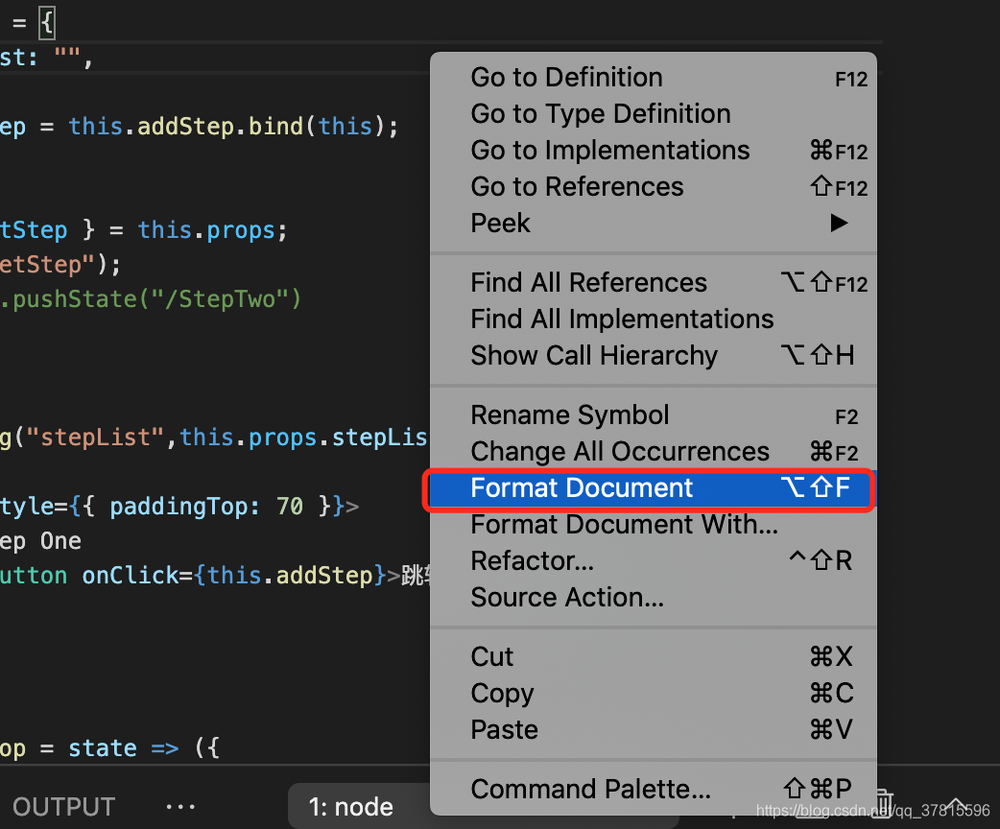

# Prettier教程

<br/>

### Prettier工具使用
#### 获取Prettier
全局安装Prettier
```
npm install -g prettier

yarn global add prettier

pnpm i -g prettier
```

#### 使用 Prettier
打开你的终端/Terminal/命令行，不管在IDE的终端里还是在系统的cmd/powershell/terminal都行
为了了解Prettier的完整功能列表，我们可以直接运行其help命令。
```
prettier -h
```
常用的两个功能： <b>检查</b>和<b>改正</b>。对prettier传入对应的flag就可以使用。
<br/>
比如我们要检查当前所在文件夹的全部文件，我们可以直接运行：
```
prettier . -c
```

这个命令的意思是：检查当前所在文件夹的全部文件，然后根据配置文件中的规则，检查出错的地方，然后在控制台输出文件名和检查结果。

如果 WARN 较多，则说明文件存在格式问题，可以直接修正。如果出现 ERROR 则通常意味着文件出现格式错误（比如没有关闭 Tag），需要自行手动修正。

直接修正则需要运行 `-w` 参数：

```
prettier . -w
```

<br/>

### VSCode 集成 Prettier 工具
1. 在VSCode中的Extension中输入prettier，找到对应的插件并且下载<br/><br/>
   <br/><br/>
2. 点击设置<br/><br/>
   <br/><br/>
3. 在设置中，按照下图操作<br/><br/>
   <br/><br/>
4. 在页面代码处，右键，选择"Format Document"，然后选择prettier，保存页面，页面代码自动格式化<br/><br/>
   <br/><br/>


### Prettier 对部分 Dart 代码不生效

Prettier 对 Dart 的支持是**有限的**。默认情况下，Prettier 仅内置了对 Web / JS / TS / CSS / JSON / Markdown 等文件类型的格式化功能，而 **Dart 语言需要单独的工具链**。

1. 现象
- `.dart` 文件在运行 `prettier . --write` 时被跳过。
- VSCode 中保存时没有触发格式化，或提示 “no parser could be inferred for file”。

2. 原因
Prettier 并未内置 Dart 解析器，社区也未正式维护 Dart 插件。Dart 官方提供了独立的格式化工具 `dart format`，与 Prettier 无缝共存但互不影响。

3. 解决方案
**使用 Dart 自带格式化器**
   ```bash
   dart format .
   ```
