# GitHub 教程
## GitHub 唯一推荐教程

[公司 GitHub 教程仓库](https://github.com/beisi-tech/beisi-github-learning)

[原版 GitHub 教程](https://youtu.be/Yn4WNemTV9Y?si=ChRgVBV2vFmYKGwy)

## GitHub 学生福利获取

[GitHub 学生福利获取](https://blog.csdn.net/m0_59118857/article/details/137478138)

## Github 使用教程

- 用自己的账号登录 github 网站https://github.com/
- 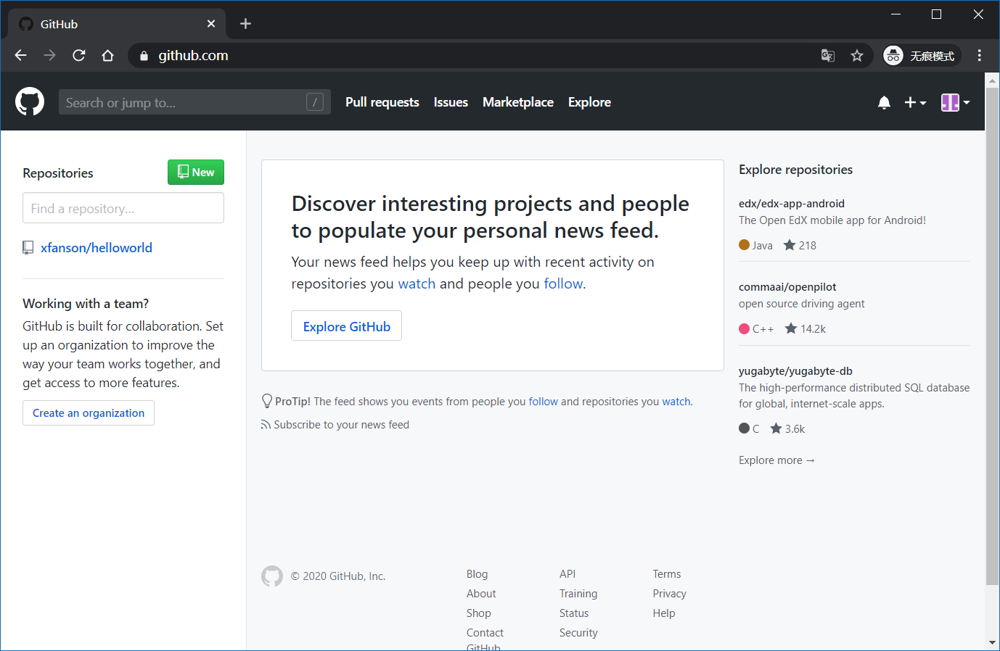

2. 加入小组的项目，邀请信已经发到各位登录 github 的邮箱里，请去邮箱查收。

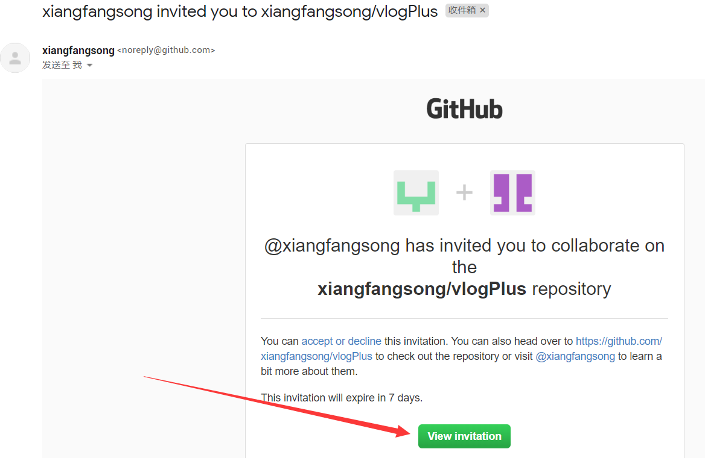

点击 View invitation，会看到下面的页面

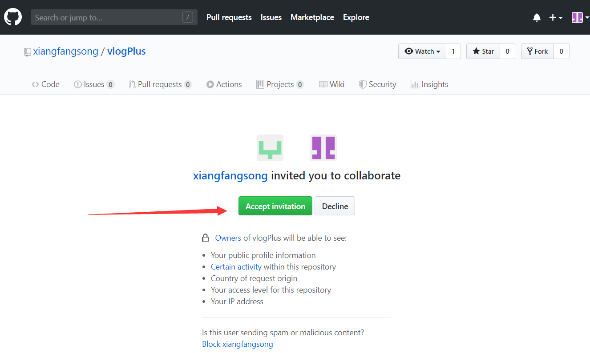

点击 Accept 接受邀请

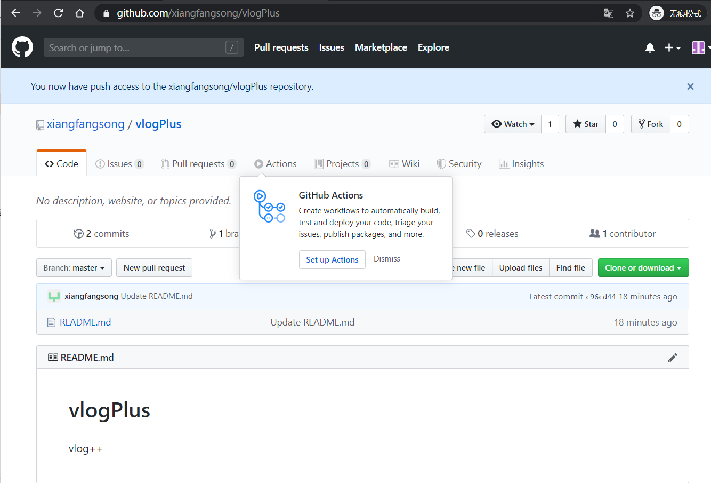

看到我们项目的仓库“vlogPlus”后，就说明仓库加入成功了！此时你可以往小组仓库里上传、下载、修改里面的文件了。

3. 安装 GitHub Desktop

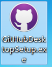双击运行 GitHubDesktopSetup.exe

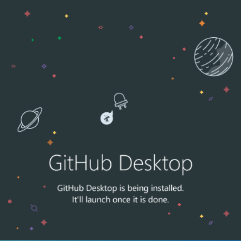

它将会自动完成安装，

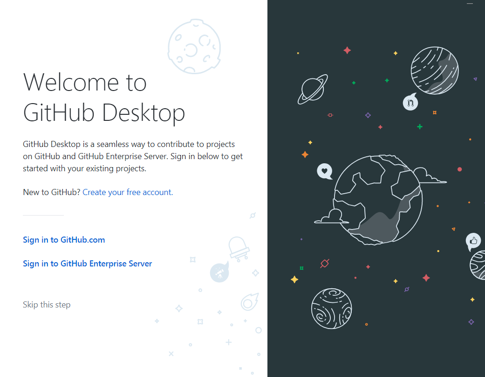

看到这个页面说明安装完成
再点击

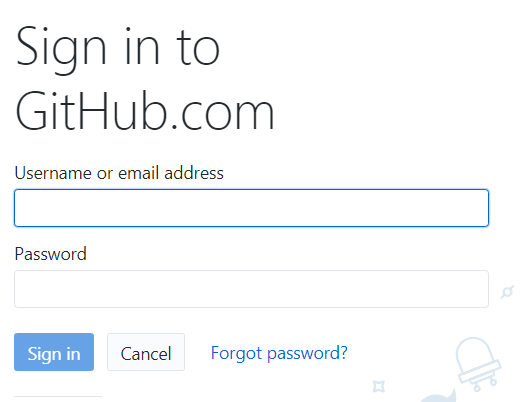

输入你的 github 用户名和密码，登录

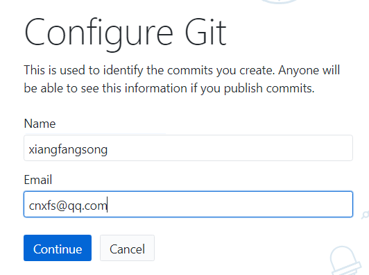

输入你的名字和邮箱，continue

这里不用选 yes，点 finish

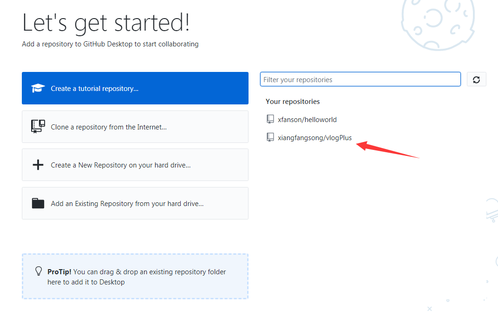

在右边可以看到我们小组的仓库

选中我们小组的仓库，点击下发的 Clone 按钮，

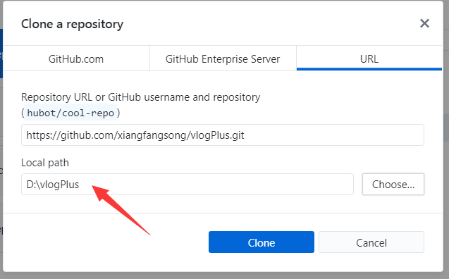

在 local path 处设置要保存在你电脑上的路径，我这里是放在 D 盘下的 vlogPlus 文件夹下，设置好了后点击 Clone

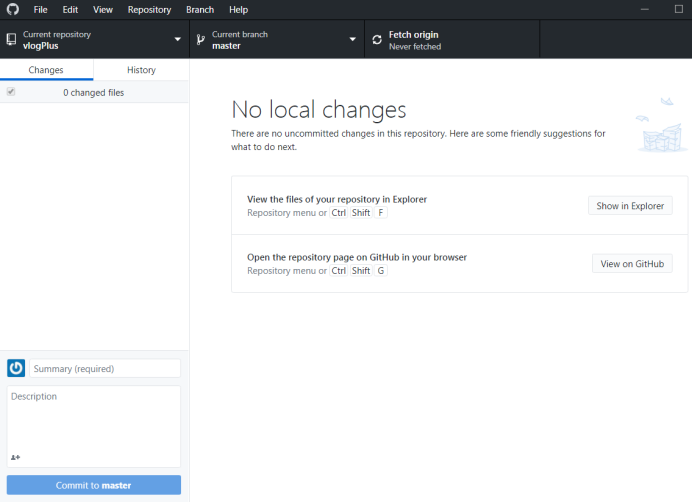

看到界面变成了这样，说明 Clone 已经完成了，在 D 盘下确实出现了 VlogPlus 文件夹

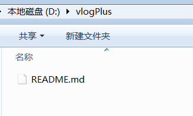

4. 上传自己写好的代码
   例如我写了一个 helloWorld.java，想把它上传到小组的仓库里，请先将你要上传的这个文件放到你本地计算机的仓库里，本教程的例子
   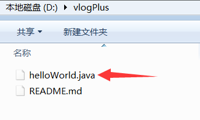

然后回到 GitHub Desktop 这个软件，会发现它检测到了 changes，也就是你修改了你本地计算机上的仓库，添加了一个 helloWorld.java 这个文件

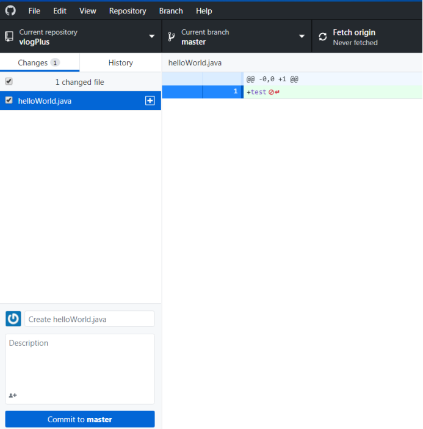

在左下角填写描述信息，说一说你做了什么修改，一定要说详细，让我们其他组员能看懂，这是代码版本管理中很重要的一个步骤

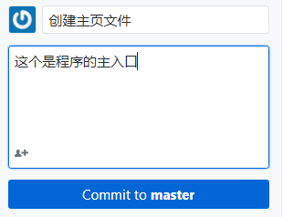

说明写好了之后，点击下面的 commit
然后点击右上角的

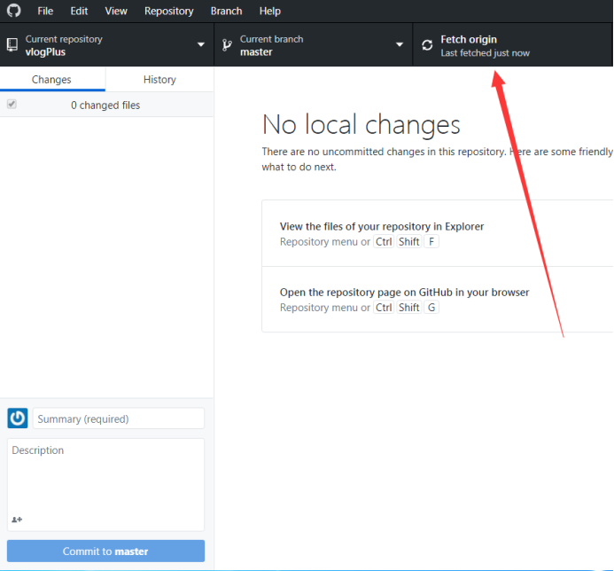

这样就成功把新文件上传到仓库上啦！

5. 修改、删除、同步本地仓库和 github 仓库
   修改和删除道理一样，只要对你电脑上的仓库里的内容进行了改变，打开 GitHub Desktop 后，它都会检测到有 changes，只要 commit 然后再 push 就可以更新 github 仓库里的内容了。
   【重要】同步仓库：每个组员每次敲代码之前都要先进行同步，在小组最新版的代码上进行工作，这样可以减少冲突！

   

点击右上角的 Fetch

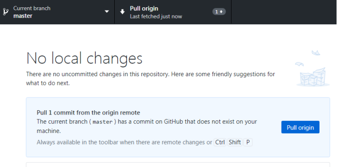

看到这个界面，说明云端的仓库有新版本，也就是说别的组员更新了新的东西上去了。再点击

，就可以把云端仓库的更新同步到本地计算机的仓库上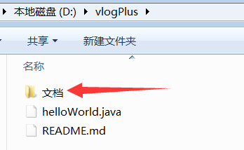
我们可以看到，别的组员新加的或修改的东西已经同步到了我的本机仓库里了。

确认同步工作做完后，大家再开始做各自的开发任务吧！！每个人都要确保自己每次都是在最新版本上做工哦！

## 使用 GitHub Desktop 进行 Fork 和 Pull Request 协作 💻

1. **Fork 仓库**

   - 登录到 [GitHub](https://github.com/)。
   - 找到目标仓库页面，点击右上角的 `Fork` 按钮。这将在你的个人账户下创建一个该仓库的副本。

2. **安装与登录 GitHub Desktop**

   - 如果尚未安装，请下载并安装 [GitHub Desktop](https://desktop.github.com/)。
   - 打开 GitHub Desktop，并使用你的 GitHub 账号登录。

3. **克隆 Fork 后的仓库**

   - 在 GitHub Desktop 中，点击 `File -> Clone Repository`。
   - 在弹出的窗口中选择 `Your Repositories` 标签页，找到你刚刚 Fork 的仓库，然后点击 `Clone` 将其克隆到本地。

4. **修改代码并提交更改**

   - 在本地编辑器中对代码进行修改。
   - 返回 GitHub Desktop，查看更改详情。
   - 按照Git 提交规范 填写提交信息，确保描述清晰准确。
   - 点击 `Commit to <branch-name>` 提交更改到本地分支。

5. **推送分支到远程仓库**

   - 提交完成后，点击 `Push Origin` 将本地分支推送到你在 GitHub 上的 Fork 仓库。

6. **发起 Pull Request (PR)**

   - 登录到 GitHub 网页端，进入你 Fork 的仓库页面。
   - 切换到你刚刚推送的分支，点击 `Compare & pull request` 按钮。
   - 在 PR 页面中，描述你的更改内容（可以包括改动原因、功能说明等）。
   - 确认无误后，点击 `Create pull request` 提交 PR。

7. **等待审查与合并**

   - 提交 PR 后，等待原仓库的维护者审查你的更改。
   - 如果审查过程中有反馈或需要修改，可以在同一分支上继续提交新的更改，这些更改会自动更新到现有的 PR 中。
   - 审查通过后，维护者会将你的更改合并到主仓库。

8. **同步原仓库更新（Sync Fork）**
   - 如果原仓库有新的更新，你需要同步你的 Fork 仓库以保持最新。
   - 登录到 GitHub 网页端，进入你 Fork 的仓库页面。
   - 在页面上方，点击 **`Sync fork`** 按钮，然后选择 **`Update branch`**。  
     如果没有看到 `Sync fork` 按钮，请确保你当前在主分支（如 `main` 或 `master`）。
   - 同步完成后，你的 Fork 仓库将包含原仓库的最新更改。

## GitHub 版本回退教程

[GitHub 版本回退教程](https://www.bilibili.com/video/BV1KE411w7Dc/?share_source=copy_web&vd_source=7f54efe1da20c04e64d8b69684311984)
